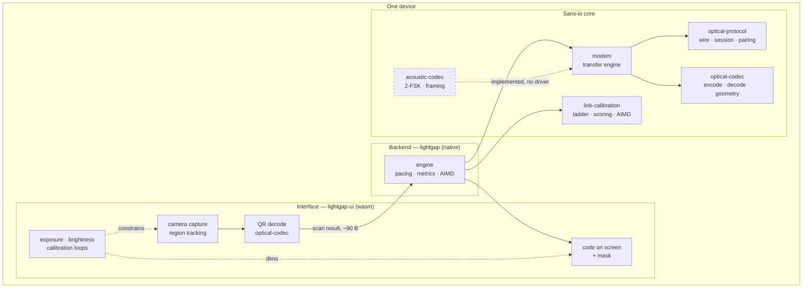
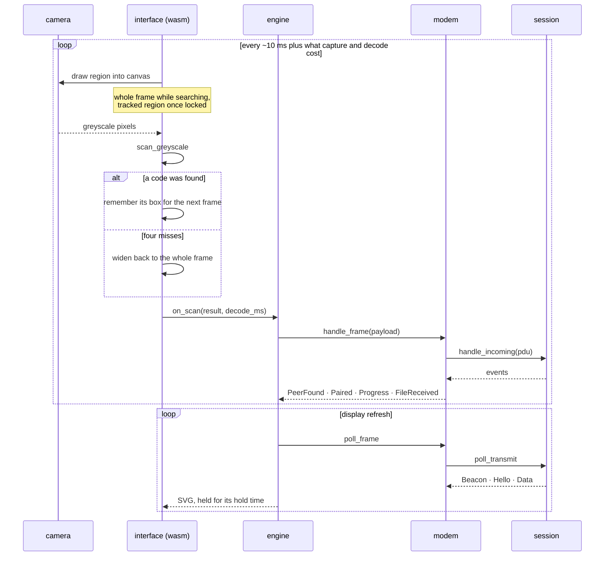

# Architecture

<!-- rev:001 (RFC 3339) 2026-08-20T16:05:00Z -->

Two devices, each running the same application, exchanging files over light.
Everything below the application is sans-io: it is handed frames, asked what to
transmit, and told that time has passed. That is what lets a 5 MB transfer at
40% loss be a unit test.

## System overview



The decode sits in the interface, not the backend. That is not where it started:
Android's WebView does not expose request bodies, so a raw binary body cannot
cross the IPC bridge at all, and nine hundred kilobytes of pixels per frame had
to stop crossing it. What crosses now is what the decode produced.

The acoustic path is drawn dashed because it is implemented and tested against
synthetic impairment and has never made a sound — there is no `cpal` driver
behind it.

## A frame's journey



## Handshake and calibration lifecycle

```mermaid
sequenceDiagram
    participant A as this end
    participant B as peer

    Note over A,B: acquisition — the smallest frame the protocol can express
    A->>B: Beacon (16 B identifier, 42 B on the wire)
    B->>A: Beacon

    Note over B: reads A, and freezes
    B->>A: Beacon + LOCKED, unchanging for 5 s
    Note over A,B: a still target is the one thing that makes<br/>the second acquisition easier than the first

    Note over A,B: escalation — only once each has been read
    A->>B: Hello (identity, X25519 key, nonce,<br/>read quality, sees-anything, camera size)
    B->>A: Hello

    Note over A,B: both derive the same six digits — compared aloud

    rect rgb(30, 40, 30)
        Note over A,B: calibration, continuous and per direction
        B-->>A: "your camera is 1280x720"
        Note over A: suggest_profile(my display, their camera)<br/>seeds the frame size
        B-->>A: "I read you at 100%"
        Note over A: AIMD refines it; the peer's figure,<br/>never our own reading
    end

    Note over A,B: transfer — the frame will not resize under it
    A->>B: Data · fountain symbols
    B-->>A: Feedback
    A->>B: Complete
```

## Source layout

| Crate | Does |
|---|---|
| `optical-protocol` | Wire format, session state machine, reliability (RaptorQ and ARQ), multiplexer, X25519 pairing. No I/O. |
| `optical-codec` | QR encode and decode, framing geometry, device profiles, and a synthetic camera with perspective warp, blur and noise. |
| `link-calibration` | Probe ladder, goodput scoring, AIMD control, channel lifecycle. Medium-agnostic. |
| `acoustic-codec` | 2-FSK modulation, Goertzel detection, framing, band assignment, synthetic impairment. |
| `channel-sim` | Loss, delay, reordering and corruption over virtual time, seeded and deterministic. |
| `modem` | Composes the above into a transfer engine: metadata, hashing, feedback cadence. |
| `tauri-app/src-tauri` | The backend: engine, commands, brightness plugin, Android glue. |
| `tauri-app` | The interface: capture, decode, display, and the calibration loops. |

## Why the core performs no I/O

The session is a pure state machine — `handle_incoming`, `poll_transmit`,
`handle_timeout` — and owns no clock. The caller does. Every reliability
guarantee this project makes is therefore testable without a camera, and the
tests that matter most exercise exactly that: a 5 MB object across a channel
losing 40% of frames, and two engines finding each other by photographing one
another's screens through a synthetic lens.

Calibration belongs to each channel rather than to the session, which is what
lets a second medium be added by implementing a trait instead of editing the
handshake.
